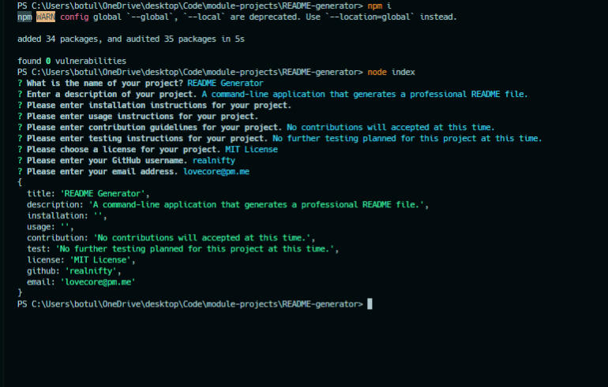

# README Generator


  
## Description

A node.js application that takes in user input in the command line that generates a professional README file for a project. The user is prompted to enter the project details and when complete, the README file is generated.



## Table of Contents

- [Installation](#installation)
- [Usage](#usage)
- [License](#license)
- [Contributing](#contributing)
- [Tests](#tests)
- [Questions](#questions)

## Installation
```
- clone this repository to your local machine
- run npm install for required dependencies
- run node index.js to initialize the application
```

## Usage

This application requires Node.js to run. Run ```node index.js``` to initialize the application. Then, enter the prompted information for the project in the command line. The README markdown file will then be generated in the ```/dist``` directory and can be copied into the root directory of your project.

## License
    
Licensed under the [MIT License](https://spdx.org/licenses/MIT.html)

## Contributing

No contributions accepted at this time.

## Tests

No tests are currently planned for this application.

## Questions

Have questions? Reach me at the following sources!

* GitHub: [realnifty](https://github.com/realnifty)
* E-mail: lovecore@pm.me
